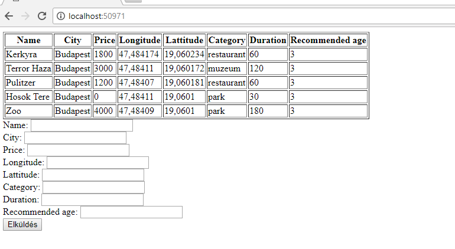
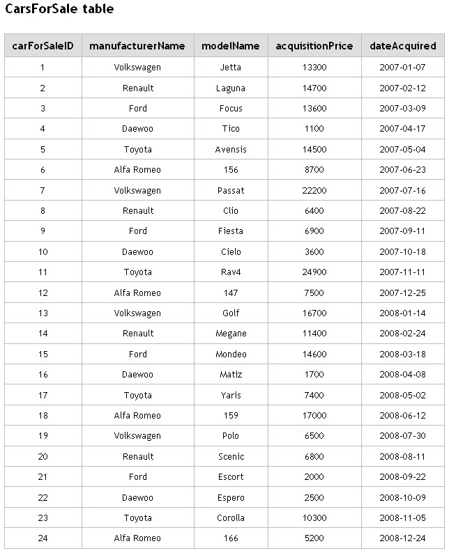

# Macrotis Orientation Exam

## Tourist Inform

Build a web application that people can use to find the best attractions

## Endpoints
- you should create these endpoints:

### GET `/`
This endpoint should render the main page:


 -  list all known attractions in a table
 -  has form to add a new one

### POST `/add`
This endpoint should
 -  check all field's content, every field is required except id  
 -  add a new attraction to the database(if all fields provided and befit to the database constraints)
 -  redirect to the main page

### GET `/edit/{id}` 
This endpoint should render the main page with prefilled attraction details in the form:
 -  list all known attractions in a table
 -  has form to edit the attraction specified by id
 
### GET `/attractions`
This endpoint should:
 -  returns a list of all filtered attractions(category, city)
 -  if no filter provided, return all attraction

example query: 
 -  `http://localhost:12345/filter?category=restaurant&city=budapest`

```json
{
    "result": "ok",
    "count": 2,
    "attractions":
    [
        {
            "id": 1,
            "name": "Kerkyra",
            "city": "Budapest",
            "price": 1800,
            "latitude": 47.484174,
            "longitude": 19.060234,
            "category": "restaurant",
            "duration": 10.0,
            "recommendedAge": 3
        },
        {
            "id": 2,
            "name": "Pulitzer",
            "city": "Budapest",
            "price": 1200,
            "latitude": 47.484162,
            "longitude": 19.060225,
            "category": "restaurant",
            "duration": 10.0,
            "recommendedAge": 3
        }
    ]
}
```
 
## 2) Question time
 -  Write an SQL query to get all `Renault` which more expensive than 8000
 -  Write an SQL query to modify all `Volkswagen`'s price 100 unit lower
 

## optional) Endpoint TESTing
 -  You should create a test case that the endpoint returns with a `200` status code for each endpoint
 -  Create a test case for a not existing endpoint, you should expect `404` status code
 -  You should create a test case for the `/filter` endpoint with `restaurant` category, it should have `?` number in the `count` and the first item's name should be `Kerkyra`  

